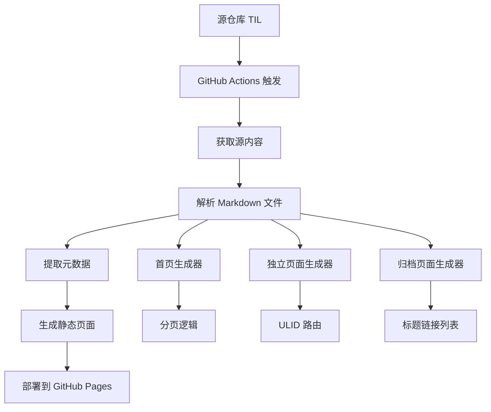

# 设计文档

## 概述

TIL 静态站点生成系统是一个基于 React 的静态站点生成器，专门为处理 TIL (Today I Learned) 内容而设计。系统从源 GitHub 仓库获取 markdown 文件，使用 react-markdown 解析其内容和元数据，然后生成极简的静态 HTML 页面。

核心特性包括：
- 分页首页显示最新 TIL 条目
- 基于 ULID 的独立页面路由
- 归档页面提供所有条目的概览
- 自动化构建和部署流程
- 响应式极简设计

## 架构

系统采用经典的静态站点生成器架构：



### 技术栈选择

- **框架**: Next.js 静态站点生成器 (React 框架)
- **UI 组件**: React 函数组件
- **Markdown 解析**: react-markdown + remark 插件
- **样式**: Tailwind CSS 实现极简设计
- **图标**: Lucide React 图标库
- **类型安全**: TypeScript
- **部署**: GitHub Actions + GitHub Pages
- **触发机制**: Repository Dispatch 或 Webhook

## 组件和接口

### 1. 内容获取器 (ContentFetcher)

负责从源仓库获取 TIL 文件：

```typescript
interface ContentFetcher {
  fetchNotes(): Promise<RawNote[]>
  validateNoteStructure(note: RawNote): boolean
}

interface RawNote {
  filename: string
  content: string
  ulid: string
}
```

### 2. Markdown 解析器 (MarkdownParser)

解析 markdown 文件并提取元数据，配合 react-markdown 使用：

```typescript
interface MarkdownParser {
  parse(content: string): ParsedNote
  extractFrontMatter(content: string): FrontMatter
  // react-markdown 直接处理渲染，不需要 renderToHtml 方法
}

interface ParsedNote {
  ulid: string
  title: string
  content: string // 原始 markdown 内容，将传递给 react-markdown
  tags: string[]
  frontMatter: FrontMatter
  // date 从 ULID 中提取，不需要单独存储
}

interface FrontMatter {
  title: string
  tags: string[]
  date: string
}

// React Markdown 组件 Props
interface MarkdownRendererProps {
  content: string
  className?: string
}
```

### 3. React 组件架构

使用 React 函数组件构建页面：

```typescript
// 页面组件 Props
interface HomePageProps {
  notes: TIL[]
  currentPage: number
  totalPages: number
}

interface IndividualPageProps {
  note: TIL
}

interface ArchivePageProps {
  notes: TIL[]
}

// 共享组件 Props
interface TILCardProps {
  note: TIL
  showFullContent?: boolean
}

interface PaginationProps {
  currentPage: number
  totalPages: number
  basePath: string
}

// Markdown 渲染组件 Props
interface MarkdownRendererProps {
  content: string
  className?: string
}

// 图标组件 Props (使用 Lucide React)
interface IconProps {
  name: string // Lucide React 图标名称
  size?: number
  className?: string
}
```

### 4. Next.js 静态生成

使用 Next.js 的静态生成功能：

```typescript
// pages/index.tsx - 首页
export async function getStaticProps(): Promise<GetStaticPropsResult<HomePageProps>> {
  const notes = await getAllNotes()
  return {
    props: {
      notes,
      currentPage: 1,
      totalPages: Math.ceil(notes.length / 10)
    }
  }
}

// pages/page/[page].tsx - 分页
export async function getStaticPaths(): Promise<GetStaticPathsResult> {
  const notes = await getAllNotes()
  const totalPages = Math.ceil(notes.length / 10)
  const paths = Array.from({ length: totalPages }, (_, i) => ({
    params: { page: (i + 1).toString() }
  }))
  return { paths, fallback: false }
}

export async function getStaticProps({ params }: GetStaticPropsContext): Promise<GetStaticPropsResult<HomePageProps>> {
  const notes = await getAllNotes()
  const currentPage = parseInt(params?.page as string) || 1
  return {
    props: {
      notes,
      currentPage,
      totalPages: Math.ceil(notes.length / 10)
    }
  }
}

// pages/[ulid].tsx - 独立页面
export async function getStaticPaths(): Promise<GetStaticPathsResult> {
  const notes = await getAllNotes()
  const paths = notes.map(note => ({
    params: { ulid: note.ulid }
  }))
  return { paths, fallback: false }
}

export async function getStaticProps({ params }: GetStaticPropsContext): Promise<GetStaticPropsResult<IndividualPageProps>> {
  const notes = await getAllNotes()
  const note = notes.find(n => n.ulid === params?.ulid)
  if (!note) {
    return { notFound: true }
  }
  return { props: { note } }
}

// pages/archive.tsx - 归档页面
export async function getStaticProps(): Promise<GetStaticPropsResult<ArchivePageProps>> {
  const notes = await getAllNotes()
  return { props: { notes } }
}
```

## 数据模型

### TIL 条目模型

```typescript
export interface TIL {
  ulid: string
  title: string
  content: string // 原始 markdown 内容
  tags: string[]
}

// 直接使用 ulid 库进行时间操作
import { decodeTime } from 'ulid'

// 获取 ULID 时间: new Date(decodeTime(ulid))
// 获取文件名: `${ulid}.md`
// 获取 URL: `/${ulid}`
}
```

### 分页模型

```typescript
// 简单的分页类型
export interface PaginationInfo {
  currentPage: number
  totalPages: number
}

// 分页常量和工具函数
export const ITEMS_PER_PAGE = 10

export function getTotalPages(totalItems: number): number {
  return Math.ceil(totalItems / ITEMS_PER_PAGE)
}

export function getPageItems<T>(items: T[], page: number): T[] {
  const start = (page - 1) * ITEMS_PER_PAGE
  return items.slice(start, start + ITEMS_PER_PAGE)
}
```

## 正确性属性

*属性是应该在系统的所有有效执行中保持为真的特征或行为——本质上是关于系统应该做什么的正式陈述。属性作为人类可读规范和机器可验证正确性保证之间的桥梁。*

基于预工作分析，以下是经过冗余消除后的核心正确性属性：

**属性 1: 首页分页一致性**
*对于任何* TIL 条目集合，当条目数量超过 10 个时，首页应该提供分页控件，并且每页应该恰好包含 10 个条目（最后一页除外）
**验证: 需求 1.3, 1.4**

**属性 2: 内容完整性**
*对于任何* TIL 条目，在首页和独立页面上显示时，应该包含完整的内容而不截断
**验证: 需求 1.2, 2.2**

**属性 3: 时间排序一致性**
*对于任何* TIL 条目集合，在首页和归档页面上都应该按创建日期降序排列（最新的在前）
**验证: 需求 1.5, 3.4**

**属性 4: ULID 到页面映射**
*对于任何* 存在的 TIL 条目，应该能够通过其 ULID 生成可访问的独立页面 URL
**验证: 需求 2.1, 2.3**

**属性 5: ULID 提取和时间戳解析**
*对于任何* 以 ULID 命名的文件，系统应该正确提取文件名中的 ULID 作为标识符，并能从 ULID 中解析出正确的时间戳
**验证: 需求 2.5, 5.3, 5.4**

**属性 6: 归档页面格式**
*对于任何* TIL 条目集合，归档页面应该仅显示标题-链接对，且链接指向正确的独立页面
**验证: 需求 3.1, 3.2, 3.3**

**属性 7: Markdown 解析往返**
*对于任何* 有效的 markdown 内容，解析为 HTML 后应该保留所有原始信息和结构
**验证: 需求 5.2**

**属性 8: 内容获取完整性**
*对于任何* Notes 目录中的有效 TIL 文件，系统应该成功解析并包含在生成的站点中
**验证: 需求 4.2, 5.1**

**属性 9: 资源最小化**
*对于任何* 生成的页面，应该包含最少的外部 CSS 和 JavaScript 资源
**验证: 需求 6.4**

**属性 10: React Markdown 渲染一致性**
*对于任何* markdown 内容，使用 react-markdown 渲染的结果应该与标准 markdown 规范保持一致
**验证: 需求 7.2, 7.4**

## 错误处理

### 文件解析错误
- 当 markdown 文件格式错误时，记录错误并跳过该文件
- 当 front matter 缺失或格式错误时，使用默认值
- 当 ULID 格式无效时，生成警告但继续处理

### 构建错误
- 当源仓库不可访问时，使用缓存的内容
- 当模板渲染失败时，生成错误页面
- 当文件写入失败时，重试机制

### 运行时错误
- 404 页面处理不存在的 ULID
- 优雅降级当 JavaScript 不可用时
- 错误页面应保持极简设计风格

## 测试策略

### 双重测试方法

系统将采用单元测试和基于属性的测试相结合的方法：

**单元测试**覆盖：
- 特定的 markdown 解析示例
- 错误条件和边缘情况
- 模板渲染的具体场景
- 文件 I/O 操作

**基于属性的测试**覆盖：
- 使用 **fast-check** 库进行属性测试
- 每个属性测试运行最少 100 次迭代
- 验证上述 10 个正确性属性
- 生成随机的 TIL 内容、日期和 ULID 进行测试
- 测试 react-markdown 渲染的一致性和正确性

**测试标记要求**：
- 每个基于属性的测试必须使用注释标记对应的设计文档属性
- 格式：`**Feature: til-static-site, Property {number}: {property_text}**`
- 每个正确性属性必须由单个基于属性的测试实现

### 测试数据生成

**智能生成器**将创建：
- 有效的 ULID 字符串
- 各种长度和复杂度的 markdown 内容
- 带有 front matter 的完整 TIL 文件
- 不同日期范围的时间戳
- 边缘情况如空内容、特殊字符等

### 集成测试

- 端到端构建流程测试
- 生成的 HTML 结构验证
- 链接完整性检查
- 响应式设计验证

## 部署和构建流程

### GitHub Actions 工作流

```yaml
name: Build and Deploy TIL Site
on:
  repository_dispatch:
    types: [til-updated]
  workflow_dispatch:

jobs:
  build-and-deploy:
    runs-on: ubuntu-latest
    steps:
      - name: Checkout target repo
        uses: actions/checkout@v3
      
      - name: Setup Node.js
        uses: actions/setup-node@v3
        with:
          node-version: '18'
      
      - name: Fetch TIL content
        run: |
          git clone --depth 1 https://github.com/zhaochunqi/til.git source
      
      - name: Install dependencies
        run: npm install
      
      - name: Build site
        run: npm run build
      
      - name: Deploy to GitHub Pages
        uses: peaceiris/actions-gh-pages@v3
        with:
          github_token: ${{ secrets.GITHUB_TOKEN }}
          publish_dir: ./dist
```

### 触发机制设置

在源仓库 (zhaochunqi/til) 中添加以下 GitHub Actions：

```yaml
name: Trigger TIL Pages Build
on:
  push:
    branches: [main]
    paths: ['notes/**']

jobs:
  trigger-build:
    runs-on: ubuntu-latest
    steps:
      - name: Trigger til-pages build
        uses: peter-evans/repository-dispatch@v2
        with:
          token: ${{ secrets.PAGES_TRIGGER_TOKEN }}
          repository: [your-username]/til-pages
          event-type: til-updated
```

### 项目结构

```
til-pages/
├── pages/
│   ├── index.tsx              # 首页 (第一页)
│   ├── page/
│   │   └── [page].tsx         # 分页页面
│   ├── [ulid].tsx             # 独立 TIL 页面
│   ├── archive.tsx            # 归档页面
│   └── 404.tsx                # 404 页面
├── components/
│   ├── TILCard.tsx            # TIL 卡片组件
│   ├── Pagination.tsx         # 分页组件
│   ├── Layout.tsx             # 布局组件
│   ├── ArchiveItem.tsx        # 归档项组件
│   ├── MarkdownRenderer.tsx   # react-markdown 渲染组件
│   └── Icon.tsx               # Lucide React 图标组件
├── lib/
│   ├── content-fetcher.ts     # 内容获取器
│   └── markdown-parser.ts     # Markdown 解析器
├── types.ts                   # TIL 数据模型和分页工具
├── styles/
│   └── globals.css            # 全局样式
├── tests/
│   ├── unit/
│   └── property/
├── out/ (Next.js 静态导出输出)
├── source/ (克隆的源仓库)
├── package.json
├── next.config.js
├── tailwind.config.js
├── tsconfig.json
└── .github/workflows/
    └── build-deploy.yml
```

### 性能考虑

- **增量构建**: 仅重新生成修改的内容
- **缓存策略**: 缓存解析的 markdown 和生成的 HTML
- **资源优化**: 内联关键 CSS，最小化 HTML
- **CDN 友好**: 生成静态资源的版本化 URL

### 监控和日志

- 构建过程日志记录
- 错误文件跟踪
- 性能指标收集
- 部署状态通知